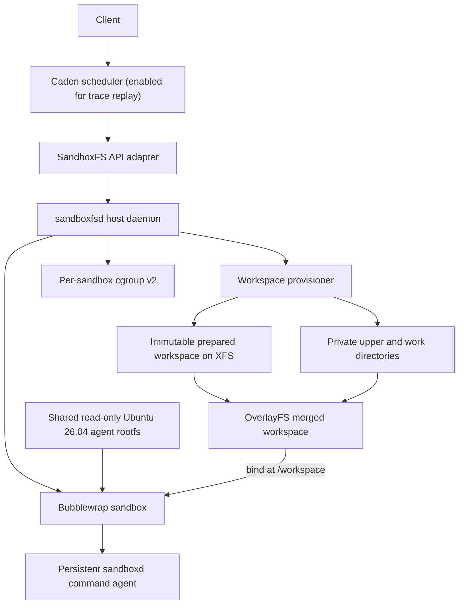

# SandboxFS + Caden: Design and Latest Performance

Status: SandboxFS cold-start and memory campaigns complete; existing Caden
trajectory replay complete but failed the tool-turn latency guardrail

Report date: 2026-07-20

Audience: systems and infrastructure engineering

## Technical summary

SandboxFS removes recursive workspace copying from sandbox cold start by
mounting one immutable prepared workspace as an OverlayFS lower and giving each
sandbox private `upper` and `work` directories. Caden is a separate scheduling
and reclaim layer. It was disabled for the standalone cold-start and T1 memory
measurements, then enabled for a separate trace-derived replay.

The new rootfs is a 3,090,101,028-byte Ubuntu 26.04 agent image with 1,016
package records. It includes Ubuntu Standard plus Python, Node, Go, Rust, Java,
Clang/CMake/Ninja, Git, ripgrep, jq, and common build utilities. The rootfs is
stored once on durable disk and read-only-bound into every Bubblewrap sandbox;
it is not copied per sandbox.

Against the required full-copy baseline, T1 exceeded the 50% cold-start target
at both tested concurrency levels:

- OS-ready p50 fell from **462.247 ms to 13.395 ms** at concurrency 1, a
  **97.1% reduction**, and from **773.948 ms to 27.901 ms** at concurrency 8,
  a **96.4% reduction**.
- Python tool-ready p50 fell from **512.512 ms to 56.534 ms** at concurrency 1,
  an **89.0% reduction**, and from **846.753 ms to 89.061 ms** at concurrency
  8, an **89.5% reduction**.
- All 400 measured cold-sandbox starts completed successfully.

T1 also reduced memory use without Caden, but the metric definition matters.
Across three counterbalanced, cache-cold pairs of eight sandboxes, time-weighted
attributable occupied DRAM fell from **8.774 GB to 0.141 GB**, a **98.4%
reduction**. The stricter `MemTotal - MemAvailable` measure fell from **0.318
GB to 0.089 GB**, a **72.1% reduction**. Aggregate sandbox-cgroup residency was
roughly unchanged at 44–45 MB and no swap was used. The saving therefore came
from avoiding private workspace copies and their duplicated page-cache pages,
not from process-RSS reclaim.

The old Caden scheduler was then retested on the same enlarged rootfs and
1.19 GB prepared workspace using 32 normalized public-agent trajectories. The
combined `T1-S2` treatment reduced time-weighted mean attributable DRAM by
**75.60%–82.77%** relative to `F0-S0`, with a paired median of **76.79%**.
Every run completed all 32 requests and 384 deterministic proxy tool calls.
However, tool-turn p95 became **15.67×–18.05×** slower, so the registered 10%
latency guardrail and the complete replay claim failed. Because this comparison
changes both the filesystem and scheduler, it does not isolate Caden's
incremental memory saving.

Both modes used the same shared, disk-backed rootfs. This campaign measures the
overall T1 workspace benefit with rootfs demand paging held constant; it does
not isolate an eager-versus-lazy rootfs treatment.

## 1. System design



### 1.1 Component boundaries

| Component | Responsibility | Boundary |
|---|---|---|
| SandboxFS | Base registration, workspace creation, Bubblewrap lifecycle, cgroups, command execution, cleanup, and timing telemetry | Does not select scheduling or reclaim policy |
| Caden | Admission, ready capacity, stage-aware CPU policy, and freeze/reclaim/restore | Uses the installed SandboxFS API; disabled for standalone SandboxFS tests and enabled for trace replay |
| OverlayFS | Namespace-level sharing between one lower and private writable uppers | Layer stack is fixed for a sandbox lifetime |
| XFS reflink | Extent sharing when OverlayFS copies up an existing lower file | Protects deferred partial writes, not initial mount latency |
| Bubblewrap | Mount and process namespace construction | Not claimed as VM-grade hostile-tenant isolation |
| cgroup v2 | CPU, memory, and PID accounting and control | I/O control is not implemented |

SandboxFS remains the execution backend. Caden communicates through
`sandboxfsctl`/`sandboxfsd` rather than importing SandboxFS internals. The
SandboxFS checkout is pinned under Caden at `third_party/sandboxfs`.

### 1.2 Workspace copy-on-write

The prepared base contains repository files, dependencies, language
environments, and caches. Each T1 sandbox receives this fixed stack:

```text
private upper-S       writable, sandbox-specific
──────────────────────────────────────────────────
prepared base         shared lower, immutable contract
```

The host layout is:

```text
/agent-xfs-t1/
├── bases/
│   └── bench-medium/          shared prepared lower
└── sandboxes/
    └── <sandbox-id>/
        ├── upper/             private writes and whiteouts
        ├── work/              OverlayFS bookkeeping
        ├── merged/            visible workspace
        ├── control/           private command socket
        └── state.json
```

An unchanged read resolves to the lower inode. A new file is allocated only in
the private upper. Deleting a lower path creates a private whiteout. A write to
an existing lower file first creates an upper inode; XFS `reflink=1` can retain
unchanged extents as shared blocks and allocate changed ranges privately.

The full-copy baseline instead executes the equivalent of:

```text
cp -a --reflink=never PREPARED_BASE/. PRIVATE_WORKSPACE
```

It walks, reads, creates, and writes the complete tree before the sandbox can
start. T1 creates directories and mounts a view without materializing lower
file data. This eliminated work is the source of the startup improvement.

### 1.3 Shared rootfs and demand paging

The rootfs and workspace lower are disk-backed shared trees. Neither is
unpacked into a per-sandbox `tmpfs`. Linux reads file pages on demand and can
share clean page-cache pages when sandboxes reference the same underlying
inodes.

The service now requires an explicit rootfs path. Its environment pins:

```text
SANDBOXFS_ROOT=/agent-xfs-t1
SANDBOXFS_ROOTFS=/opt/sandboxfs/rootfs/ubuntu-26.04-agent-standard-amd64-20260720
```

The rootfs builder installs `/workspace` before the image becomes read-only so
Bubblewrap has a valid bind target. An end-to-end identity probe verified Ubuntu
26.04 and every declared tool through the normal sandbox API.

Increasing the rootfs from a minimal image to 3.09 GB does not make every start
read 3.09 GB. OS-ready touches only the pages needed for Bubblewrap,
`sandboxd`, and `/bin/true`; tool-ready additionally faults Python and the
`json`/`pathlib` modules. Untouched compilers, JDK files, and other packages stay
on disk.

## 2. Lifecycle and measured readiness boundaries

Cold start begins when `sandboxfsd` receives `CreateSandbox` and has two
reported endpoints:

1. **OS-ready:** `/bin/true` completes through the persistent in-sandbox
   `sandboxd` API.
2. **Tool-ready:** after OS-ready, the benchmark executes
   `python3 -c 'import json, pathlib; print("ready")'`; tool-ready ends when that
   command succeeds through the same API.

Creation performs:

1. Validate the request, mode, base digest, and resource limits.
2. Build the full-copy workspace or create and mount the private OverlayFS view.
3. Create the cgroup-v2 leaf.
4. Launch Bubblewrap against the explicitly pinned rootfs.
5. Wait for the private `sandboxd` socket.
6. Run `/bin/true` and record OS-ready.
7. Run the benchmark tool command and record tool-ready.

Workspace latency is the contained filesystem-preparation phase only. It does
not include cgroup setup, Bubblewrap, socket readiness, `/bin/true`, or the
Python command.

Destruction stops `sandboxd`, escalates to process-group kill after a deadline,
unmounts the merged workspace, removes the cgroup, and deletes only a validated
path beneath the sandbox root. The integration suite checked base immutability,
private writes, whiteouts, rename, hard links, symlinks, cross-sandbox
isolation, cgroup removal, and zero leaked OverlayFS mounts.

## 3. Comparison and metric definitions

### 3.1 Configurations

| Label | Workspace construction | Rootfs | Caden |
|---|---|---|---|
| Full copy (`F0-S0`) | Recursive private copy with reflink disabled | Shared read-only agent rootfs | Disabled |
| T1 (`T1-S0`) | Shared lower plus private OverlayFS upper/work on XFS `reflink=1` | Same shared read-only agent rootfs | Disabled |
| T1 + Caden (`T1-S2`) | Same T1 workspace | Same shared read-only agent rootfs | Ready pool plus stage-aware freeze/reclaim/restore |

Full copy is the only baseline. `T1-S0` and `T1-S2` are treatments. The
rootfs, limits, corpus, host, and sandbox API are held constant within each
campaign; the cold-start, standalone-memory, and trajectory workloads are
reported separately.

### 3.2 Latency metrics

| Metric | Definition |
|---|---|
| OS-ready | Create request receipt through successful `/bin/true` |
| Tool-ready | Create request receipt through successful Python tool completion |
| Workspace | Recursive copy or OverlayFS directory creation and mount only |
| Cleanup | Destroy request through process, mount, cgroup, and workspace removal |

The latency campaign used 100 iterations per mode at concurrency 1 and 8. The
prepared base was local and the host page cache was warm; cache was not dropped
between iterations. This is a cold-sandbox, warm-host result.

## 4. EC2 testbed and workload

### 4.1 Testbed

| Item | Value |
|---|---|
| Instance | AWS `i7i.2xlarge`, 8 vCPUs, 64 GiB |
| Instance ID | `i-0982bfe56bd176b17` (`sandboxfs`) |
| Region/AZ | `ap-southeast-1` / `ap-southeast-1a` |
| Local storage | one 1,875 GB EC2 NVMe instance-store SSD |
| OS / AMI | Ubuntu Server 26.04 LTS amd64 / `ami-0d29e10623105ca41` |
| Kernel | `7.0.0-1008-aws` |
| CPU | Intel Xeon Platinum 8559C |
| Bubblewrap / XFS tools | 0.11.1 / 6.18.0 |
| XFS treatment | local NVMe formatted with `reflink=1` |
| Rootfs | Ubuntu 26.04 agent rootfs; 3,090,101,028 bytes; 102,969 entries; 1,016 package records |
| Rootfs file-tree SHA-256 | `05afd4cc6cff2e3016b7bbeabc792e04ebf4afb0d648a781a52920a3d64976f7` |
| Prepared workspace | 10,004 files; 1,189,888,015 logical bytes |

The rootfs includes Ubuntu Standard and a real multi-language agent toolchain;
its size is not synthetic padding. The prepared workspace contains 10,000
small dependency files and 1 MiB, 100 MiB, and 1,024 MiB regular files.

### 4.2 Why T1 avoids eager disk and DRAM materialization

The following unified example illustrates the mechanism. The 1 GB workspace,
100 MB accessed subset, and 4 KB result are explanatory round numbers, not the
literal benchmark command or measured corpus. The actual tool probe imported
`json` and `pathlib`, printed `ready`, and did not create `result.txt`.

**Full-copy baseline:** the complete workspace is copied before readiness. The
copy creates a private inode tree and fills page cache while Python later loads
only the subset it needs.

```text
Shared disk          Private sandbox disk
1 GB ───copy 1 GB───► 1 GB

                         ↓ ready
                    run Python
                         ↓
                    load 100 MB into DRAM
                         ↓
                    write result.txt to disk
```

**T1:** readiness creates an OverlayFS view with an empty private upper. Python
faults only the pages it reads, while a new result is allocated directly in the
upper.

```text
Shared disk                Private XFS upper
1 GB ◄── OverlayFS view ── empty

                 ↓ ready
            run Python
                 ↓
     read required 100 MB into DRAM
                 ↓
      write 4 KB result.txt to upper
```

The diagrams separate two forms of laziness. T1 avoids copying the 1 GB
workspace before ready, and Linux demand paging avoids loading untouched file
pages into DRAM. OverlayFS provides the shared namespace and private write path;
the page cache provides on-demand reads. A write to `result.txt` does not copy
the lower tree because it is a new upper-only file.

### 4.3 Memory workload and definitions

The memory campaign used three pairs in order `F0-S0 → T1-S0`, `T1-S0 →
F0-S0`, and `F0-S0 → T1-S0`. Every run dropped the host page cache, sampled at
25 ms, created eight sandboxes concurrently, ran the same Python command, and
held them resident for five seconds. Each mode therefore completed 24 sandbox
executions with identical work.

| Metric | Definition |
|---|---|
| Attributable occupied DRAM | `(MemTotal - MemFree)` minus the pre-run idle mean; includes reclaimable page cache |
| Attributable unavailable DRAM | `(MemTotal - MemAvailable)` minus the pre-run idle mean; excludes memory Linux considers readily reclaimable |
| Attributable file cache | Host file-cache bytes minus the pre-run idle mean |
| Sandbox-cgroup memory | Sum of `memory.current` for the eight sandbox cgroups |
| Active mean | Time-weighted mean over create, tool, and five-second resident phases |

No Caden transition, `memory.reclaim`, cgroup freeze, artificial memory holder,
or swap tier was active.

### 4.4 Trace-derived Caden memory workload

The Caden campaign used 32 normalized trajectories from the public
`nebius/SWE-rebench-openhands-trajectories` dataset, revision
`35455389ab51bf5e2306bfd436ef72d0f98bf882`. The converter retained the first
12 executable calls from each trajectory and produced 384 deterministic proxy
calls against `bench-medium`:

| Operation | Calls | Proxy behavior |
|---|---:|---|
| View | 196 | Read dependency files |
| Search | 77 | Search the prepared dependency tree |
| Test | 49 | Read a prepared large-file range |
| Shell | 48 | Enumerate and hash the prepared manifest |
| Build | 13 | Copy 8 MiB into the private workspace |
| Edit | 1 | Append metadata and create a private 4 KiB file |

The trace manifest SHA-256 was
`d640241dd1f88d0d8b527e2343f763ec0536778b351a36b7ce1b84a6a7b5ebfd`.
Every proxy tool call was preceded by a fixed synthetic one-second `LLM_WAIT`.
The campaign ran no LLM, real agent runtime, or anonymous-memory holder.

Three pairs ran in order `F0-S0 → T1-S2`, `T1-S2 → F0-S0`, and `F0-S0 →
T1-S2`. Each configuration admitted at most four sandboxes, allowed two
concurrent tool wakes, dropped host caches before the run, and sampled memory
at 100 ms. `F0-S0` used static residency with no pool or reclaim. `T1-S2` used
two reclaim workers, a 100 ms reclaim grace, and a one-shot ready pool with
target one and cap two.

| Metric | Definition |
|---|---|
| Attributable DRAM | `(MemTotal - MemAvailable)` above the first idle sample |
| Sandbox DRAM | Sum of sandbox-cgroup `memory.current` |
| Sandbox swap | Sum of sandbox-cgroup `memory.swap.current` |
| Waiting-sandbox DRAM | `memory.current` for sandboxes reporting `LLM_WAIT` |
| Active mean | Time-weighted mean over pool preparation, creation, and replay |
| Tool-turn latency | `RESPONSE_WAKE` through command completion and `RESULT_PACK` |

The registered latency guardrail required treatment tool-turn p95 to remain
within 10% of baseline. Equal completed work, three runs per configuration,
counterbalanced order, zero command failures, swap, major faults, wake latency,
throughput, and reclaim errors were all checked before interpreting DRAM.

### 4.5 Artifact persistence

The local NVMe filesystem is ephemeral. Raw reports and rootfs metadata were
first preserved on durable EBS, then copied into the repository and verified
against the EC2 SHA-256 manifest. The trace-derived replay artifacts are under
`results/orca-trajectory-replay-2026-07-20/` and are also copied into the
independent workload tree. AWS was stopped only after these copies and
checksums completed.

## 5. OverlayFS preserved the cold-start gain with a 3.09 GB rootfs

All values below are server-side. Each configuration completed 100/100
iterations; the redundant success column is omitted.

| Mode | Concurrency | OS-ready p50 | OS-ready p95 | OS-ready p99 | Workspace p50 | Tool-ready p50 | Tool-ready p95 | Tool-ready p99 |
|---|---:|---:|---:|---:|---:|---:|---:|---:|
| Full copy | 1 | 462.247 ms | 479.673 ms | 485.077 ms | 448.011 ms | 512.512 ms | 527.559 ms | 531.684 ms |
| T1 | 1 | 13.395 ms | 27.344 ms | 28.423 ms | 0.977 ms | 56.534 ms | 70.925 ms | 72.115 ms |
| Full copy | 8 | 773.948 ms | 913.638 ms | 930.418 ms | 746.243 ms | 846.753 ms | 983.255 ms | 1,002.074 ms |
| T1 | 8 | 27.901 ms | 33.308 ms | 36.310 ms | 1.360 ms | 89.061 ms | 108.108 ms | 115.819 ms |

| Concurrency | OS-ready p50 reduction | OS-ready p95 reduction | Tool-ready p50 reduction | Tool-ready p95 reduction |
|---:|---:|---:|---:|---:|
| 1 | 97.1% | 94.3% | 89.0% | 86.6% |
| 8 | 96.4% | 96.4% | 89.5% | 89.0% |

At concurrency 1, workspace construction consumed 448.011 ms of the 462.247
ms baseline OS-ready p50. T1 reduced that phase to 0.977 ms. The corresponding
99.8% workspace-phase reduction explains why the end-to-end reduction remains
well above 50% after adding a realistic rootfs.

Tool-ready is intentionally higher than OS-ready because Python must start and
import modules. At concurrency 1, that additional API/command path was about
43 ms for T1. It remains demand-driven: the tool does not load the entire 3.09
GB rootfs.

## 6. T1 reduced host DRAM without Caden by avoiding duplicate page cache

The table reports means across three runs per mode. GB and MB use decimal units.

| Metric | Full copy | T1 | Reduction |
|---|---:|---:|---:|
| Attributable occupied DRAM, active mean | 8.774 GB | 0.141 GB | 98.4% |
| Attributable occupied DRAM, active p95 | 11.415 GB | 0.151 GB | 98.7% |
| Attributable occupied DRAM, active peak | 11.415 GB | 0.151 GB | 98.7% |
| Attributable occupied DRAM, resident mean | 11.405 GB | 0.151 GB | 98.7% |
| Attributable unavailable DRAM, active mean | 0.318 GB | 0.089 GB | 72.1% |
| Attributable unavailable DRAM, resident mean | 0.385 GB | 0.095 GB | 75.3% |
| Attributable file cache, active mean | 8.565 GB | 0.100 GB | 98.8% |
| Aggregate sandbox-cgroup memory, resident mean | 44.1 MB | 45.5 MB | -3.0% |
| Peak sandbox swap | 0 | 0 | — |

The primary occupied-DRAM reduction was stable across pairs: **98.20% to
98.59%**. The unavailable-memory reduction was positive in every pair but more
variable at **59.16% to 80.24%**.

The mechanism is visible in the decomposition. Full copy creates eight private
1.19 GB workspace trees. Those distinct inodes retain roughly 8.6 GB of
attributable cache during the active window. T1 creates eight nearly empty
uppers and keeps one shared lower, so the measured active cache increment is
about 0.1 GB. Linux can reclaim most of the baseline cache under pressure,
which is why the `MemAvailable`-based reduction is materially smaller than the
occupied-DRAM result.

The sandbox processes themselves did not shrink: aggregate resident
`memory.current` was 44.1 MB for full copy and 45.5 MB for T1, an insignificant
3.0% movement in the opposite direction. T1 therefore provides proactive
workspace materialization avoidance, while Caden would provide reactive reclaim
of memory an agent has already touched. These effects must be measured
separately before they are combined.

The memory run also shows what this campaign does not establish. Because both
modes share the same disk-backed rootfs, no percentage above can be attributed
to a rootfs-format change. A separate eager per-sandbox rootfs treatment would
be required to isolate that effect.

## 7. The old Caden policy reduced DRAM but failed the latency guardrail

Every one of the six trace runs completed 32 requests and 384 proxy tool calls
without an OOM, command failure, or reclaim error. Paired comparisons show the
combined effect of T1 workspace sharing, the ready pool, and Caden reclaim:

| Pair | Order | Mean DRAM reduction | Ready p50 reduction | Ready p95 reduction | Tool-turn p95 ratio | Duration ratio |
|---|---|---:|---:|---:|---:|---:|
| 1 | `F0-S0` → `T1-S2` | 82.77% | 97.33% | 97.88% | 17.55× | 1.342× |
| 2 | `T1-S2` → `F0-S0` | 76.79% | 97.20% | 97.70% | 18.05× | 1.326× |
| 3 | `F0-S0` → `T1-S2` | 75.60% | 96.70% | 97.61% | 15.67× | 1.389× |
| Median | counterbalanced | **76.79%** | **97.20%** | **97.70%** | **17.55×** | **1.342×** |

The following table reports the median absolute measurement across the three
runs per configuration. MB and GB use decimal units.

| Metric | `F0-S0` | `T1-S2` | Interpretation |
|---|---:|---:|---|
| Active mean attributable DRAM | 778.4 MB | 176.8 MB | primary memory metric |
| Active p95 attributable DRAM | 1,141.8 MB | 214.7 MB | paired median reduction 79.80% |
| Active peak attributable DRAM | 1,442.8 MB | 286.8 MB | paired median reduction 81.00% |
| Active mean sandbox `memory.current` | 92.3 MB | 71.9 MB | process and charged page-cache residency |
| Active p95 sandbox `memory.current` | 234.4 MB | 126.6 MB | smaller cgroup tail |
| Active peak sandbox `memory.current` | 241.8 MB | 166.0 MB | no hidden treatment peak |
| Waiting-sandbox `memory.current` | 127.6 MB | 22.9 MB | reclaim removed 82.1% at the median |
| Active mean / peak sandbox swap | 0 / 0 | 79.1 / 89.2 MB | reclaimed pages moved to local NVMe swap |
| Request-to-ready p50 | 8.253 s | 0.230 s | full copy versus T1 plus ready pool |
| Request-to-ready p95 | 19.221 s | 0.443 s | burst tail improved |
| Tool-turn p50 | 0.048 s | 2.861 s | restore serialization dominates |
| Tool-turn p95 | 0.321 s | 5.578 s | failed the 10% guardrail |
| Tool-turn p99 | 0.529 s | 6.361 s | severe tail regression |
| Wake/restore p95 | 0.294 s | 5.277 s | main latency source |
| Command-only p95 | 0.061 s | 0.910 s | refault continued inside tools |
| Active duration | 35.078 s | 47.601 s | treatment took 34.2% longer at the paired median |
| Request throughput | 0.912/s | 0.672/s | 26.3% lower at the median |
| Cumulative reclaimed bytes | 0 | 6.032 GB | pages were reclaimed repeatedly |
| Reclaim events / errors | 0 / 0 | 384 / 0 | one reclaim per declared wait |
| Major faults | 320 | 92,688 | direct evidence of refault cost |
| Failed requests / calls | 0 / 0 | 0 / 0 | equal completed work |

The DRAM target passed, but the complete result did not. A 100 ms grace is far
shorter than every synthetic one-second wait, so the old policy reclaims after
nearly every turn and immediately pays restore and refault cost. Moving about
79 MB to swap is not free memory: it is lower DRAM residency exchanged for
local-NVMe I/O and major faults when the sandbox wakes.

The 76.79% paired-median reduction must be described as a **combined
`F0-S0`-to-`T1-S2` result**, not an Caden-only result. Full copy creates private
workspace inodes and cache, while T1 shares the lower; Caden additionally
reclaims pages already touched during waits. A same-trace `T1-S0` run is needed
to subtract the filesystem effect and quantify the scheduler's incremental
saving.

The Caden policy and replay code were unchanged from the preceding trajectory
campaign. The measured revisions were Caden
`e1cfc3632b293268aa8998e55aca941f99bb419f` and SandboxFS
`652aa279bbb2afb4068d4b838e2df8e103b247fe`. The SandboxFS revision fixes an
accidental hard-coded 500 ms per-sandbox HTTP-client timeout by using the
configured daemon command timeout; it does not change scheduling or reclaim.
All six measured runs began only after that transport fix and passed the full
test suites.

## 8. Implementation changes validated by these campaigns

- The rootfs builder now creates a versioned Ubuntu 26.04 agent image, installs
  the declared multi-language toolset, cleans package caches, emits a package
  manifest and size record, and creates Bubblewrap's `/workspace` bind target.
- The systemd service and installer now require and persist
  `SANDBOXFS_ROOTFS`, preventing silent fallback to the host root filesystem.
- `sandboxfsbench` accepts a JSON tool command and reports tool client,
  tool-command, and create-to-tool-ready percentiles independently of
  OS-ready and workspace timings.
- The Caden-free memory harness samples host DRAM, file cache, cgroup memory,
  anonymous/file composition, swap, and major faults at 25 ms and retains raw
  phase-labelled samples.
- The trace replay reports attributable DRAM, sandbox `memory.current`, swap,
  faults, wake/restore latency, throughput, failures, pool events, and reclaim
  events for equal normalized workloads.
- SandboxFS now applies its configured command timeout to persistent sandbox
  agent clients instead of imposing an unrelated 500 ms transport deadline.
- The campaign finalizer records rootfs identity, package and binary hashes,
  service configuration, sandbox identity probes, leak checks, and SHA-256
  checksums.

## 9. Recommended next steps

1. Run `T1-S0`, `T1-S1`, and `T1-S2` on the exact same trace to isolate lower
   page-cache sharing, admission/pool policy, and reclaim.
2. Replace the fixed 100 ms reclaim grace with a break-even policy: reclaim
   only when predicted wait exceeds measured reclaim plus restore/refault cost
   and a safety margin. Register and enforce the turn-latency SLO online.
3. Repeat the warm-host latency campaign in counterbalanced order and add a
   separately labelled host-cold first-tool campaign. Pin rootfs packages to a
   timestamped Ubuntu snapshot rather than a moving mirror.

## 10. Limitations and further questions

### Limitations that materially affect interpretation

1. All campaigns used one EC2 host. Cold-start latency is cold-sandbox and
   warm-host; it excludes boot and remote image transfer, and its mode order was
   not counterbalanced.
2. The standalone 98.4% result includes reclaimable page cache. The trace
   result uses `MemAvailable`, but `F0-S0` versus `T1-S2` still crosses both the
   filesystem and scheduler; no same-trace `T1-S0` ablation was run.
3. The public trajectories determine action mix, but deterministic proxies and
   synthetic one-second waits replace real repositories, agents, LLM latency,
   and production arrival patterns.

### Further questions

1. What incremental DRAM reduction does `T1-S2` provide over same-trace
   `T1-S0`, and which memory types account for it?
2. What wait-duration threshold and hot-page policy avoid the measured
   restore/refault cost while retaining useful reclaim?
3. What is the separately measured host-cold first-tool cost of this 3.09 GB
   rootfs, and which tool-specific imports dominate it?

The measured engineering conclusion is narrow: with a realistic Ubuntu agent
rootfs, fixed OverlayFS workspace construction removes the dominant full-copy
cold-start cost and independently avoids duplicated workspace cache. The old
Caden policy can push the combined DRAM reduction past 75% on the trace-derived
workload, but its reclaim-every-wait behavior causes an unacceptable major-
fault storm and tool-turn regression. It is therefore a mechanism result, not
a production or internal Multi-Agent performance claim.
