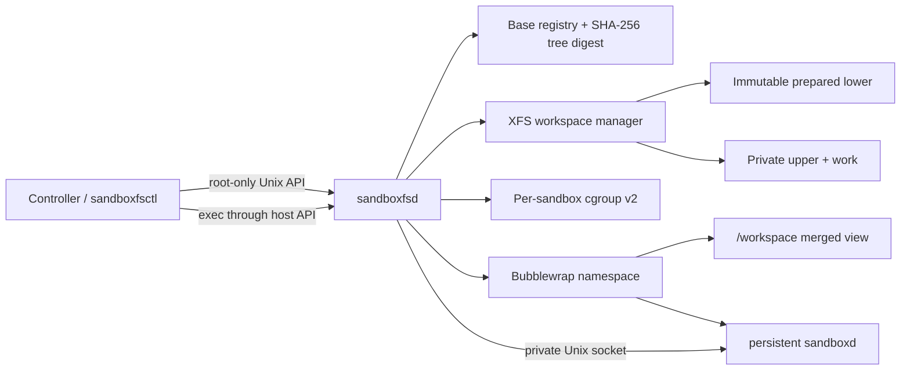

# SandboxFS: Design, Implementation, Evaluation, and Reflection

Status: MVP complete; one EC2 T1→T0 campaign evaluated  
Date: 2026-07-18  
Repository: [`franchyi/sandboxfs`](https://github.com/franchyi/sandboxfs)  
Measured implementation commit: `5935547090f6ddf9f05672c3da1e69e0527d6361`

## 1. Executive summary

SandboxFS was built to test a narrow engineering hypothesis: if an LLM-agent
sandbox begins from a large prepared workspace, replacing recursive copying
with a fixed copy-on-write filesystem view should reduce create-to-first-command
latency by at least 50% on a warm host.

The implementation confirms that hypothesis for the evaluated corpus. The
full-copy baseline needed a p50 of 465.052 ms at concurrency 1 and 805.474 ms
at concurrency 8. OverlayFS on reflink-enabled XFS, called T1, reduced those
values to 10.715 ms and 26.667 ms. Its p95 reduction was 94.4% at concurrency 1
and 96.4% at concurrency 8. All 600 cold starts in the final baseline, T0, and
T1 reports succeeded.

The most important conclusion is more precise than “XFS reflink makes startup
fast”:

1. Fixed OverlayFS eliminates the up-front tree walk and data copy. This is the
   source of the cold-start improvement.
2. XFS reflink changes what happens later, when a sandbox first modifies a
   lower-layer file. It allows OverlayFS copy-up to share unchanged extents.
3. T0 and T1 therefore have almost identical startup latency, but radically
   different first-write amplification. A 4 KiB edit to a 1 GiB lower file
   wrote approximately 1,024 MiB in T0 and 0.016 MiB in T1.

SandboxFS is not a reproduction of DeltaBox or Crab. It is a stock-Linux,
fixed-layer workspace provisioner inspired by DeltaBox's filesystem data
sharing. It does not implement live layer-stack switching, checkpoint/rollback,
CRIU restoration, process templates, or microVM boot.

## 2. Problem statement and original hypothesis

An LLM agent often needs a private writable workspace containing a repository,
dependencies, caches, language environments, and tools. A simple provisioner
recursively copies that prepared tree for every sandbox. This offers intuitive
isolation, but its latency and I/O scale with the number of files and bytes in
the base even when the agent changes only a small fraction of it.

The initial target was:

> Reduce end-to-end sandbox cold-start latency by at least 50% relative to a
> full, non-reflink recursive copy of the same locally prepared workspace.

The claim was deliberately scoped to a cold sandbox on a warm host. The base
was already materialized on local storage; image download, repository clone,
host boot, and remote cache fill were excluded.

Before implementation, the governing feasibility model was:

```text
overall reduction = filesystem fraction × (1 - optimized/original filesystem time)
```

This prevents a common systems mistake: accelerating a component that is too
small to move the end-to-end metric. In the measured baseline, workspace
preparation accounted for about 449.6 ms of the 465.1 ms p50 at concurrency 1,
so the filesystem was large enough to justify the project.

## 3. Experimental treatments and terminology

There is one baseline and two design treatments:

| Name | Workspace construction | XFS format | Purpose |
|---|---|---|---|
| Baseline | `cp -a --reflink=never BASE/. WORKSPACE` | Measured on T1-format disk | Ordinary private filesystem tree and the only baseline |
| T0 | Fixed OverlayFS with private upper/work | `reflink=0` | Isolate the benefit of eliminating up-front copying |
| T1 | Fixed OverlayFS with private upper/work | `reflink=1` | Add extent-sharing copy-up for modified lower files |

T0 is not a “reflink baseline.” It is an ablation of the selected design. T0
and T1 use the same OverlayFS structure and sandbox runtime; only the XFS
reflink feature differs.

Cold-start latency begins when `sandboxfsd` receives `CreateSandbox` and ends
only after `/bin/true` successfully completes through the persistent in-sandbox
command API. Merely mounting the filesystem or spawning Bubblewrap does not
count as ready.

## 4. Relationship to DeltaBox and Crab

The design borrows two ideas associated with DeltaBox's DeltaFS path:

- represent private sandbox state as layers above a shared read-only base; and
- use filesystem copy-on-write so unchanged data remains physically shared.

The resemblance ends at the fixed filesystem view. DeltaBox adds live
generation changes: the current writable upper can be frozen and a new upper
inserted while the filesystem remains mounted and processes retain open file
descriptors. Vanilla OverlayFS does not expose an API to mutate an active
mount's `lowerdir`, `upperdir`, and `workdir` stack. Achieving those semantics
requires the custom kernel/filesystem work, plus CRIU and process-template
machinery, described by DeltaBox.

SandboxFS creates one stack and keeps it unchanged for the sandbox lifetime:

```text
private upper-S       writable
─────────────────────────────
prepared base         read-only contract
```

Crab solves another problem. Its selective checkpointing and replay machinery
targets recovery of a running agent. That may become useful for rollback, but
it is not required to remove initial workspace copying and was not included in
the measured claim.

## 5. Architecture



### 5.1 Host daemon: `sandboxfsd`

`sandboxfsd` is the narrow privileged component. It:

- validates sandbox identifiers and treatment compatibility;
- registers and verifies prepared bases;
- creates a full-copy tree or mounts a private OverlayFS workspace;
- creates resource-control cgroups;
- launches Bubblewrap after dropping to the `ubuntu` account;
- waits for `sandboxd` and runs the readiness command;
- records phase timings and durable state;
- executes commands through `sandboxd`; and
- destroys or reconciles processes, mounts, cgroups, and directories.

The MVP host control socket is root-only. This is an operational choice, not a
multi-tenant authorization system.

### 5.2 Persistent command agent: `sandboxd`

Each sandbox runs one small Go process for its lifetime. `sandboxd` serves
health, exec, and shutdown endpoints over a private Unix socket. Commands run
in their own process groups so timeouts can kill descendants, not merely the
immediate shell. Standard output, standard error, exit status, and execution
duration are returned as structured data.

Keeping `sandboxd` alive ensures readiness and later tool calls use the normal
sandbox API. It also avoids starting a new Bubblewrap namespace for each agent
tool invocation.

### 5.3 Process sandbox

Bubblewrap supplies mount, PID, IPC, UTS, user, and network namespaces. The
host performs the privileged OverlayFS mount; the sandbox process never
receives host `CAP_SYS_ADMIN`.

This evaluation did not use a Docker or OCI image. With the default
`--rootfs /`, Bubblewrap exposes the host's `/usr` and `/etc` read-only, creates
Ubuntu usrmerge symlinks, supplies private `/tmp` and `/run`, and bind-mounts
the workspace at `/workspace`. The host was Ubuntu Server 26.04 LTS. The daemon
also supports an explicitly supplied unpacked rootfs, but that path was not
used in the campaign.

Bubblewrap was chosen over one Firecracker VM per sandbox because it can bind
the host OverlayFS mount directly. Firecracker would shift the experiment
toward per-VM block images and add VM boot to the metric. The MVP does not claim
a hostile multi-tenant security boundary.

### 5.4 Prepared workspace base

Prepared bases live beneath the active XFS campaign root:

```text
/agent-xfs-t1/
├── bases/
│   └── bench-medium/
├── sandboxes/
└── measurements/
```

Registration resolves the path, requires it to be a child of `bases`, walks
the tree, and stores a SHA-256 digest plus file and logical-byte counts. The
registry rejects replacement once an active reference is recorded. Reference
increment is not yet transactional with the pre-readiness portion of creation,
so hardening that narrow concurrent replacement window remains future work.

“Immutable” is currently a contract checked by digest, not a hard seal against
a privileged host writer. The integration suite verifies that sandbox writes
do not mutate the base, but the daemon does not yet make a base read-only at the
mount or inode level.

## 6. Filesystem-level behavior

### 6.1 Reads, creates, and deletes

- Reading an unchanged path resolves directly to the shared lower tree.
- Creating a new file allocates it in the sandbox's private upper directory.
- Deleting a lower path creates an OverlayFS whiteout in the upper; the lower
  file remains intact.
- Renames, symlinks, hard links, and metadata operations are presented through
  the merged view and recorded privately when they change state.

### 6.2 First modification of a lower file

OverlayFS requires an upper version before it can modify a lower regular file.
The difference between T0 and T1 is how that upper version obtains its data.

In T0, XFS cannot clone file extents. OverlayFS falls back to copying file data
into a new upper inode before applying the write. A 4 KiB in-place edit can
therefore copy a 1 GiB file.

In T1, OverlayFS can request a file-range clone. XFS creates a new upper inode
whose data extents initially reference the same physical blocks as the lower
file. When the sandbox changes 4 KiB, XFS performs block-level copy-on-write
for the affected region while unchanged extents remain shared.

```text
Logical view after first write

lower inode  ─┐
              ├── shared unchanged XFS extents
upper inode  ─┘
     └──────────── private blocks for modified ranges
```

XFS reflink is not content-based deduplication. The filesystem shares extents
because OverlayFS explicitly clones from a known source; it does not scan the
disk for unrelated identical content.

### 6.3 Workloads that reflink cannot improve

If a tool writes a complete temporary file and atomically renames it over a
lower file, the temporary file is new upper data and has no source extents to
clone. A full rewrite similarly dirties nearly every extent. The deferred-cost
campaign confirmed that temporary replacement and full rewrite allocate and
write roughly the new file size in both T0 and T1.

## 7. Sandbox lifecycle

### 7.1 Base registration

1. Resolve and validate the base path.
2. Walk the tree and hash relative paths, types, modes, sizes, link targets,
   and regular-file contents.
3. Persist the registry atomically in `/var/lib/sandboxfs/bases.json`.
4. Select the base by registered name during creation.

### 7.2 Creation and readiness

1. Validate ID, base, mode, and resource limits.
2. Reserve the sandbox ID in the daemon's runtime map.
3. Create a full-copy workspace or `upper`, `work`, and `merged` directories.
4. Mount OverlayFS for T0/T1.
5. Create the per-sandbox cgroup.
6. Use `setpriv` for a direct credential transition and launch Bubblewrap.
7. Move the Bubblewrap process into the cgroup.
8. Poll the private `sandboxd` health socket.
9. Execute `/bin/true` through the command API.
10. Mark the sandbox running and atomically persist its state.

Phase timestamps separate workspace preparation, process spawn, socket
readiness, command readiness, and total server-side latency.

### 7.3 Execution

The host daemon forwards an argv array, optional working directory,
environment overrides, and timeout to `sandboxd`. Shell interpretation occurs
only when the caller explicitly invokes a shell. This keeps the API suitable
for ordinary agent tool execution and avoids constructing shell command strings
inside the control plane.

### 7.4 Destruction and recovery

Destruction asks `sandboxd` to shut down, escalates to process-group `SIGKILL`
after a deadline, unmounts the merged workspace, removes the sandbox cgroup,
and deletes only a path proven to be below the configured `sandboxes` root.

On daemon startup, reconciliation scans stale state. It kills recognizable
sandbox processes, unmounts stale merged paths, removes sandbox directories,
and resets base references. This is deliberately conservative: an unmount
failure prevents directory removal rather than hiding a leaked mount.

## 8. Resource isolation and system integration

The systemd service uses `Delegate=yes` so the daemon can manage a cgroup v2
subtree. The daemon first moves itself into a leaf cgroup; this is necessary
because cgroup v2 does not allow controllers to be delegated below a cgroup
that still contains processes. It then enables CPU, memory, and PID controllers
and creates one leaf per sandbox.

Default MVP limits are:

- 8 GiB `memory.max`;
- 512 `pids.max`; and
- two CPUs worth of quota (`200000/100000`).

I/O limits were discussed in the design but are not implemented in the current
cgroup manager. This should not be represented as completed functionality.

## 9. Safety properties implemented

The most consequential host operations are mount, unmount, format, and recursive
cleanup. The implementation therefore includes explicit guards:

- sandbox and base names use a bounded identifier grammar;
- registered bases must resolve beneath the active `bases` directory;
- cleanup targets must resolve beneath `sandboxes` and cannot equal its root;
- upper/work directories are unique per sandbox;
- mode checks reject T0 on `reflink=1` and T1 on `reflink=0`;
- preflight tests both OverlayFS isolation and actual reflink behavior;
- the XFS formatter refuses the root disk, mounted devices, non-disks, and
  devices whose model is not EC2 instance storage; and
- reports are copied to durable EBS and the repository before destructive
  format changes or instance stop.

These checks reduce operational risk but do not turn the MVP into a hardened
multi-tenant platform.

## 10. Evaluation methodology

### 10.1 Host and software

| Item | Value |
|---|---|
| EC2 instance | `i7i.2xlarge`, 8 vCPUs, 64 GiB |
| Region/AZ | `ap-southeast-1a` |
| Local storage | 1,875 GB EC2 NVMe instance store |
| OS | Ubuntu Server 26.04 LTS |
| AMI | `ami-0d29e10623105ca41` |
| Kernel | `7.0.0-1008-aws` |
| CPU | Intel Xeon Platinum 8559C |
| Bubblewrap | 0.11.1 |
| XFS tools | 6.18.0 |
| Go | 1.26.0 |

The corpus contained 10,004 files and 1,189,888,015 logical bytes, including
1 MiB, 100 MiB, and 1 GiB files. Its digest was identical after rebuilding the
T0 and T1 instance-store filesystems.

### 10.2 Campaign procedure

1. Format the instance-store NVMe device as XFS `reflink=1`.
2. Generate and register the prepared corpus.
3. Run preflight and integration tests.
4. Run 100 iterations for baseline and T1 at concurrency 1 and 8.
5. Run deferred read/write experiments and save reports on root EBS.
6. Stop the service, verify no active sandbox or mount, and reformat the same
   device as XFS `reflink=0`.
7. Rebuild the identical corpus and run T0 at concurrency 1 and 8.
8. Run T0 deferred-cost tests and preserve the reports.
9. Restore the device to T1, rerun preflight/integration, and publish all raw
   reports to the repository.
10. Stop the EC2 instance and verify AWS reports `stopped`.

The T0 cold-start report does not contain a separately repeated full-copy
baseline. Its displayed reduction uses the T1 campaign's full-copy result on
the same host and device; that copy explicitly disables reflink. A future
formal campaign should run the baseline in both filesystem-format periods and
reverse the campaign order on a fresh instance.

### 10.3 Measurement boundaries

The primary `ready` value is server-side receipt-to-readiness. The benchmark
also records client-observed request time, workspace preparation, and cleanup.
The prepared base is local and the host page cache is not deliberately dropped,
so the result is correctly described as cold sandbox on a warm host—not
host-cold or storage-cold startup.

## 11. Results

### 11.1 End-to-end cold start

| Mode | Concurrency | Success | p50 ready | p95 ready | p99 ready | p50 workspace | p95 workspace |
|---|---:|---:|---:|---:|---:|---:|---:|
| Baseline | 1 | 100/100 | 465.052 ms | 478.250 ms | 484.563 ms | 449.565 ms | 464.912 ms |
| T0 | 1 | 100/100 | 10.781 ms | 27.244 ms | 28.308 ms | 0.987 ms | 1.172 ms |
| T1 | 1 | 100/100 | 10.715 ms | 26.851 ms | 27.922 ms | 0.953 ms | 1.996 ms |
| Baseline | 8 | 100/100 | 805.474 ms | 903.760 ms | 944.168 ms | 783.388 ms | 872.910 ms |
| T0 | 8 | 100/100 | 26.661 ms | 32.117 ms | 35.126 ms | 1.272 ms | 2.458 ms |
| T1 | 8 | 100/100 | 26.667 ms | 32.692 ms | 32.964 ms | 1.270 ms | 2.233 ms |

T1 reduced p50 by 97.7% at concurrency 1 and 96.7% at concurrency 8. It
reduced p95 by 94.4% and 96.4%, respectively. The close match between T0 and T1
shows that mounting a fixed OverlayFS view, not reflink, produced the startup
result.

The baseline's workspace phase consumed about 96.7% of server-side p50 latency
at concurrency 1. T1 reduced that phase from roughly 450 ms to roughly 1 ms,
which explains why the end-to-end result moved by much more than the 50%
target.

### 11.2 Deferred first write

Each operation changed 4 KiB in place and flushed the file before device
counters were sampled.

| Treatment | Lower file | Command duration | Observed NVMe writes |
|---|---:|---:|---:|
| T0 | 1 MiB | 13.799 ms | 1.021 MiB |
| T1 | 1 MiB | 13.164 ms | 0.016 MiB |
| T0 | 100 MiB | 53.799 ms | 100.022 MiB |
| T1 | 100 MiB | 13.157 ms | 0.014 MiB |
| T0 | 1,024 MiB | 422.004 ms | 1,024.018 MiB |
| T1 | 1,024 MiB | 12.924 ms | 0.016 MiB |

This is the strongest evidence for retaining XFS reflink even though it does
not further reduce cold-start mount time. T1 prevents large, delayed latency
spikes and write amplification when agents patch existing large files in
place.

Device-sector deltas include filesystem metadata and background effects, so
they should not be interpreted as exact block-accounting proofs. Their scaling
with lower-file size in T0 and near-constant small value in T1 is nevertheless
unambiguous in this controlled test.

### 11.3 Cleanup

At concurrency 1, median cleanup was 70.823 ms for baseline and 11.121 ms for
T1. At concurrency 8, it was 560.396 ms and 19.553 ms. Removing a copied tree
therefore imposes a second tree-sized cost that the OverlayFS design also
avoids.

### 11.4 Correctness and isolation

The integration suite verified:

- lower-file reads and private modifications;
- new files, deletion whiteouts, rename, hard links, and symlinks;
- unchanged prepared-base digest after sandbox activity;
- invisibility of one sandbox's writes from another sandbox;
- equivalent isolation for the full-copy baseline;
- existence and removal of per-sandbox cgroups;
- no sandbox directories after destruction; and
- no leaked OverlayFS mounts.

The final host audit showed an active T1 service, an unchanged base digest, an
empty sandbox list, and zero leaked sandbox OverlayFS mounts before the
instance was stopped.

## 12. Implementation journey and lessons

### 12.1 The final artifact could not remain a Bash script

The first shell prototype was useful for proving that OverlayFS and Bubblewrap
could compose. It could not provide a meaningful create-to-first-command
boundary, persistent command execution, concurrent lifecycle coordination,
recovery, structured state, or phase metrics.

Moving the control path into Go was therefore part of the experiment rather
than unnecessary productization. It made the treatment and baseline share the
same API and runtime, preventing orchestration differences from being mistaken
for filesystem performance.

Shell remains the right layer for host bootstrap, guarded disk formatting,
systemd installation, and campaign orchestration.

### 12.2 Concurrent startup exposed a recursive bind-mount race

An early Bubblewrap command recursively read-only-bound `/` as the sandbox
root. Under concurrent creation, the live host root included transient merged
OverlayFS mounts belonging to other sandboxes. One sandbox could disappear
while Bubblewrap recursively remounted the tree, producing intermittent
`Invalid argument` failures.

The fix was a stable minimal root: bind only `/usr` and `/etc` read-only,
construct usrmerge symlinks, and explicitly create the few required empty
directories. The final T1 concurrency-8 campaign then completed 100/100 starts.

Lesson: a namespace root must be defined from stable inputs. Recursively
capturing a live mount tree couples otherwise independent sandbox lifecycles.

### 12.3 Direct credential transition mattered at concurrency

Using `runuser` introduced PAM/logind work and additional concurrency noise.
Replacing it with `setpriv` made the UID/GID transition a direct process-launch
operation and simplified the measured path.

Lesson: a filesystem experiment still needs a controlled process-launch path.
Unrelated account-session machinery can dominate or destabilize a millisecond
scale treatment.

### 12.4 cgroup v2 delegation has structural rules

Simply setting `Delegate=yes` was insufficient. Controllers cannot be enabled
for children while the service process remains in the same non-leaf cgroup.
The daemon had to move itself into `daemon/`, enable controllers at the service
and sandbox-parent levels, and then create sandbox leaves.

Lesson: resource isolation is part of lifecycle correctness, and cgroup v2's
no-internal-process rule must shape the daemon hierarchy.

### 12.5 Baseline fidelity required explicit copy semantics

On XFS, an ordinary `cp` may use reflink automatically, accidentally turning
the baseline into another copy-on-write treatment. The implementation therefore
uses `--reflink=never`. It also copies `BASE/.` rather than `BASE`, avoiding an
extra directory level in the private workspace.

Lesson: the baseline must prohibit the optimization being evaluated and must
present the same visible workspace layout.

### 12.6 Deferred-cost measurement needed writeback control

Initial device-sector samples could include delayed writeback from baseline
setup, and a command returning did not guarantee its data had reached the
device counters. The harness was corrected to flush setup outside the measured
interval and use `sync -f` within each write operation.

Lesson: moving work out of cold start is only acceptable if the deferred work
is measured with an explicit durability boundary.

## 13. What the project proved

Within the stated warm-host scope, the evidence supports these claims:

1. Recursive private-tree materialization dominated the selected baseline.
2. A fixed stock-Linux OverlayFS mount removed nearly all of that cost.
3. The improvement survived concurrency 8 and improved rather than degraded in
   percentage terms, consistent with greater contention among full copies.
4. XFS reflink did not materially affect mount/readiness latency.
5. XFS reflink did eliminate file-size-proportional first-write copy-up for
   in-place modifications.
6. The same command API and Bubblewrap runtime can be used for the full-copy
   baseline and both treatments.
7. Correct teardown matters: the design also avoids expensive recursive
   baseline cleanup.

## 14. What the project did not prove

The current evidence does not establish:

- performance for a real repository, package manager, compiler, or complete
  LLM-agent trajectory;
- host-cold, image-pull, repository-clone, or remote-base latency;
- a hostile multi-tenant security boundary;
- behavior above concurrency 8 or at very high mount density;
- a reverse-order T0→T1 replication on a fresh host;
- a same-format repeated full-copy baseline during the T0 period;
- long-running capacity behavior of XFS shared extents;
- automatic enforcement of prepared-base immutability;
- a portable, content-addressed OS rootfs;
- I/O bandwidth controls;
- live snapshots, rollback, or preservation of open-file generations; or
- process-memory checkpoint and restore.

The 94–97% reductions should therefore be stated as results for this corpus and
testbed, not universal expectations for every agent sandbox.

## 15. Operational reflection

The selected I7i instance store made T0/T1 comparison clean because the same
physical NVMe device could be reformatted. It also created an operational
constraint: instance-store contents are ephemeral across stop. Code and raw
reports must live in GitHub and on durable EBS, and every new experiment must
rebuild XFS, the corpus, base registration, and daemon state.

The project now requires the following experiment ending sequence:

1. verify no live sandboxes or leaked mounts;
2. preserve machine-readable reports on EBS;
3. sync required code, metadata, and results to the repository;
4. stop the EC2 instance; and
5. verify AWS reports the instance as `stopped`.

This is part of experimental correctness as well as cost discipline. A run is
not finished merely because the benchmark process exited.

## 16. Recommended next steps

### Priority 0: strengthen reproducibility

- Build a versioned minimal Ubuntu rootfs instead of borrowing host `/usr` and
  `/etc`.
- Add a one-command rebuild path for the ephemeral XFS volume, corpus, base
  registration, service install, preflight, and integration test.
- Record the benchmark commit directly in every report at measurement time.
- Run the full-copy baseline in both T0 and T1 campaign periods.

### Priority 1: validate representative agent workloads

- Construct bases from real repositories and dependency environments.
- Measure representative edit, test, package-install, and build trajectories.
- Report the fraction of writes that are in-place versus temp-file replacement.
- Track upper-layer allocation, shared extents, device writes, and cleanup over
  the complete trajectory.

### Priority 2: harden lifecycle and isolation

- Enforce base sealing rather than relying only on a digest contract.
- Introduce an explicit control-plane authorization group or service API.
- Add mount-density, daemon-crash, forced-kill, and disk-pressure campaigns.
- Implement and test I/O controls if noisy-neighbor isolation becomes a goal.

### Priority 3: evaluate checkpointing only if required

If agent rollback becomes a product requirement, treat it as a separate
project. A DeltaBox-like path would require dynamic layer generation,
open-file correctness, CRIU integration, process templates, and likely a
Firecracker boundary. Crab-like selective replay should be compared against
that full recovery objective, not credited to initial cold-start acceleration.

## 17. Final reflection

The project began with uncertainty about whether the key idea was copy-on-write
or overlapping filesystem work with LLM inference. The implementation and
measurements resolve that ambiguity. No overlap was necessary: removing the
up-front copy directly reduced the measured end-to-end path. The result is
therefore attributable to filesystem provisioning rather than scheduling or
hidden work.

It also clarified that “copy-on-write” names two distinct mechanisms in this
design. OverlayFS provides namespace-level copy-on-write and makes startup
independent of base size. XFS reflink provides extent-level copy-on-write and
makes the first in-place modification proportional to changed blocks rather
than whole-file size. Both are valuable, but for different phases.

The largest practical lesson is that a convincing systems result depends as
much on boundaries and controls as on the optimization itself: one baseline,
the same sandbox API, a real readiness command, explicit reflink disabling,
stable namespace inputs, durable write measurement, cleanup verification, and
preserved machine-readable evidence. Those choices turned a plausible shell
demo into an engineering result that can be inspected, repeated, and improved.

## 18. Repository map

- [`README.md`](../README.md): build, install, and usage entry point.
- [`docs/design.md`](design.md): detailed prospective engineering design and
  DeltaBox comparison.
- [`internal/host/manager.go`](../internal/host/manager.go): workspace and
  sandbox lifecycle.
- [`internal/agent/server.go`](../internal/agent/server.go): persistent command
  agent.
- [`internal/cgroup/manager.go`](../internal/cgroup/manager.go): cgroup v2
  delegation and limits.
- [`scripts/integration-test.sh`](../scripts/integration-test.sh): filesystem
  correctness, isolation, and cleanup validation.
- [`scripts/deferred-cost-test.sh`](../scripts/deferred-cost-test.sh): first-read
  and first-write measurements.
- [`results/ec2-2026-07-17/README.md`](../results/ec2-2026-07-17/README.md):
  compact result tables and exact testbed metadata.
- [`results/ec2-2026-07-17`](../results/ec2-2026-07-17): raw JSON evidence.
